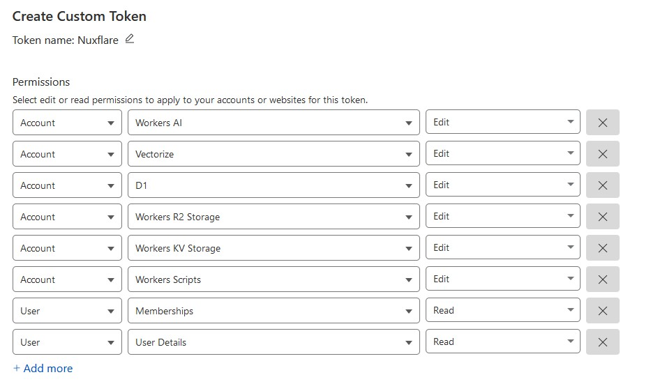

# Nuxflare

The fastest, open-source way to deploy your Nuxt applications to Cloudflare.
Nuxflare simplifies deployment with a single CLI command and requires only a Cloudflare API token - no additional accounts or complex setup needed.

## Overview

Nuxflare automatically deploys resources according to your [NuxtHub](https://hub.nuxt.com) configuration, enabling seamless integration with `@nuxt-hub/core`.

> NuxtHub is a platform for managing and deploying full-stack Nuxt applications globally using Cloudflare’s infrastructure.

### Key Features

- Single-command deployment using Infrastructure as Code (powered by [SST](https://sst.dev))
- CI/CD friendly - easy integration with your existing pipelines
- Requires only a Cloudflare API token
- Automatic resource provisioning for NuxtHub services:
  - AI
  - Blob Storage
  - Database
  - Cache
  - KV Storage
  - Vectorize

## Quick Start

### 1. Clone a Template

Start by cloning a NuxtHub template that demonstrates the full capabilities of Nuxflare:

```bash
git clone https://github.com/RihanArfan/chat-with-pdf.git
```

### 2. Initialize Nuxflare

Initialize your project using the Nuxflare CLI:

```bash
npx nuxflare init
```

During initialization:
- Choose your project name
- Select your preferred package manager
- Nuxflare will create a `sst.config.ts` file for deploying resources

### 3. Set Up Cloudflare Credentials

1. Create a Cloudflare API token with the required permissions using [this link](https://dash.cloudflare.com/profile/api-tokens?permissionGroupKeys=%5B%7B%22key%22:%22ai%22,%22type%22:%22edit%22%7D,%7B%22key%22:%22vectorize%22,%22type%22:%22edit%22%7D,%7B%22key%22:%22d1%22,%22type%22:%22edit%22%7D,%7B%22key%22:%22workers_r2%22,%22type%22:%22edit%22%7D,%7B%22key%22:%22workers_kv_storage%22,%22type%22:%22edit%22%7D,%7B%22key%22:%22workers_scripts%22,%22type%22:%22edit%22%7D,%7B%22key%22:%22memberships%22,%22type%22:%22read%22%7D,%7B%22key%22:%22user_details%22,%22type%22:%22read%22%7D%5D&name=Nuxflare)



2. Set the token in your environment

### 4. Configure Environment Variables

To copy your local environment variables to your deployment stage:

```bash
npx nuxflare copy-env --stage dev
```

This command will:
1. Read your local `.env` file
2. Show a preview of the variables to be copied
3. Set the environment variables for your specified stage

### 5. Deploy Your Application

Deploy to your chosen environment:

```bash
npx nuxflare deploy --stage dev
```

You can use any stage name and deploy multiple instances to a single account using different stage names.

### 6. Local Development

To connect to a deployed remote environment during development:

```bash
npx nuxflare dev --stage dev
```

This command starts the Nuxt development server and connects to the specified remote using `NUXT_HUB_PROJECT_URL` and `NUXT_HUB_PROJECT_SECRET_KEY`.
